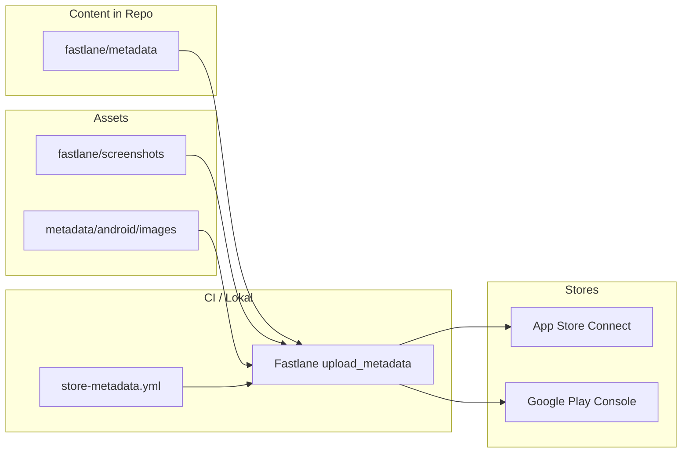
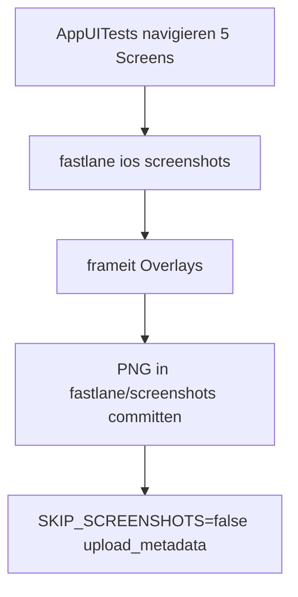

# Marketingplan App Store + Play Store (Fastlane-umsetzbar)

## Ausgangslage

Hively hat bereits eine **vollständige Fastlane-Basis** für Store-Listings:


| Bereich                        | Status                                                                                      |
| ------------------------------ | ------------------------------------------------------------------------------------------- |
| Listing-Texte (de/fr/it/en)    | Vorhanden in `[fastlane/metadata/](fastlane/metadata/)`                                     |
| Upload-Lanes                   | `[fastlane/Fastfile](fastlane/Fastfile)` — `ios upload_metadata`, `android upload_metadata` |
| CI-Workflow                    | `[.github/workflows/store-metadata.yml](.github/workflows/store-metadata.yml)`              |
| ASO-Screenshot-Copy            | `[docs/marketing/aso-screenshot-texts.md](docs/marketing/aso-screenshot-texts.md)`          |
| Offline-Marketing (Flyer, UTM) | `[docs/marketing/README.md](docs/marketing/README.md)`                                      |


**Lücken (grösster Hebel):**

- Keine Store-Screenshots im Repo (nur 1 automatisierter Screenshot in `[ios/App/AppUITests/AppUITests.swift](ios/App/AppUITests/AppUITests.swift)`)
- iOS-CI lädt nur `de-DE` hoch (`STORE_IOS_LOCALES: de-DE`)
- Android-Changelogs werden nicht hochgeladen (`skip_upload_changelogs: true`)
- Kein `frameit` für ASO-Overlays
- Keine Store-Install-Links in der Marketing-Landing




---

## 1. Positionierung & Zielgruppe

**Kernbotschaft (einheitlich über beide Stores):**

> Stockbuch am Bienenstand — offline, ohne Login. Cloud, Team und KI optional mit Hively Pro.

**Zielgruppe:** Hobby- und Nebenerwerbsimker in der Schweiz (primär), DACH als Sekundärmarkt über de/fr/it/en-Listings.

**Differenzierung gegenüber generischen Notiz-/Kalender-Apps:**

- Bienenstand-spezifisch (Völker, Varroa, Honig, Saisonkalender)
- Lokal-first / offline am Stand
- Schweizerdeutsch-KI (nur Pro, klar gekennzeichnet)

**Regeln** (bereits in `[.cursor/rules/store-metadata.mdc](.cursor/rules/store-metadata.mdc)`):

- Kernfunktionen ohne Abo; Pro/KI/Login/Internet immer explizit
- Keine erfundenen Rankings oder «kostenlos»-Versprechen ohne Kontext

---

## 2. ASO-Strategie (Texte in Fastlane)

### 2.1 Keyword-Cluster (de-DE Priorität)


| Cluster   | Keywords (Beispiele)                             | Wo platzieren                          |
| --------- | ------------------------------------------------ | -------------------------------------- |
| Kern      | Imkerei, Bienen, Bienenstand, Bienenvolk, Imker  | `keywords.txt` (iOS), Titel/Untertitel |
| Funktion  | Kontrolle, Varroa, Honig, Stockkarte, Behandlung | Beschreibung, Screenshots              |
| Nutzen    | offline, Stockbuch, Saisonkalender               | Subtitle, Short Description            |
| Long-tail | Bienen Radar, Bienenpatenschaft, Team Imkerei    | Full Description                       |


**iOS** `[fastlane/metadata/de-DE/keywords.txt](fastlane/metadata/de-DE/keywords.txt)` (aktuell 9 Begriffe, ~70 Zeichen von 100): Platz für 2–3 weitere Long-tail-Begriffe prüfen (z. B. `Saisonkalender`, `Stockbuch`).

**Android** hat kein separates Keyword-Feld — Keywords in `title.txt` + `short_description.txt` + ersten 250 Zeichen von `full_description.txt` priorisieren.

### 2.2 Listing-Text-Optimierung (pro Locale)

Für jede Sprache in `[fastlane/metadata/{locale}/](fastlane/metadata/)` und `[fastlane/metadata/android/{locale}/](fastlane/metadata/android/)`:


| Feld             | iOS Limit | Android Limit | Optimierungsziel                             |
| ---------------- | --------- | ------------- | -------------------------------------------- |
| Name/Titel       | 30        | 30            | Marke + Nutzen («Hively – Bienen Tracker» ✓) |
| Subtitle / Short | 30 / —    | 80            | Stärkster Nutzen in ersten Wörtern           |
| Promo / —        | 170       | —             | Saisonaler Hook (Frühjahr: «Varroa-Saison»)  |
| Description      | 4000      | 4000          | Bullet-Struktur beibehalten; CTA am Ende     |
| Release Notes    | 4000      | 500           | Pro Release anpassen (aktuell generisch)     |


**Konkrete Copy-Anpassungen (de-DE Beispiel):**

- `subtitle.txt`: A/B-Variante vorbereiten — z. B. «Offline am Bienenstand» vs. «Völker & Kontrollen»
- `promotional_text.txt`: Saisonal rotieren (4 Varianten/Jahr in einem Kalender-Doc)
- `description.txt`: Ersten Absatz als «Above the fold» schärfen (Nutzen in 1 Satz)

### 2.3 Saisonaler Promo-Kalender (nicht Fastlane, aber steuert `promotional_text.txt`)


| Monat   | Promo-Hook (de)                          |
| ------- | ---------------------------------------- |
| Feb–Apr | Frühjahrsinspektion — Checklisten bereit |
| Mai–Jun | Schwarmzeit — Völker im Blick            |
| Jul–Aug | Honigernte dokumentieren                 |
| Sep–Nov | Varroa-Behandlung protokollieren         |
| Dez–Jan | Saisonplanung & Finanzen                 |


Änderungen nur in `promotional_text.txt` → `bundle exec fastlane ios upload_metadata` (jederzeit änderbar ohne App-Release).

---

## 3. Screenshot-Strategie & Fastlane-Pipeline

### 3.1 Screenshot-Set (aus `[aso-screenshot-texts.md](docs/marketing/aso-screenshot-texts.md)`)


| #   | Screen                | iPhone | iPad | Android |
| --- | --------------------- | ------ | ---- | ------- |
| 1   | Kästen-Übersicht      | ✓      | ✓    | ✓       |
| 2   | Kontrolle/Checkliste  | ✓      | —    | ✓       |
| 3   | Finanzen              | ✓      | —    | ✓       |
| 4   | Bienenstände          | ✓      | ✓    | ✓       |
| 5   | Offline/Einstellungen | ✓      | —    | ✓       |


**iPad:** 3 Screenshots (Dashboard, Kontrolle, Finanzen+Honig) — siehe ASO-Doc.

### 3.2 Produktions-Pipeline (macOS erforderlich)




**Schritt 1 — UI-Tests erweitern** (`[AppUITests.swift](ios/App/AppUITests/AppUITests.swift)`):

- `data-testid` → `accessibilityIdentifier` für Nav-Buttons (`nav-hives`, `nav-inspections`, …)
- 5 `snapshot()`-Aufrufe gemäss ASO-Doc
- Wartezeiten/WebView-Ready-Checks stabilisieren

**Schritt 2 — Screenshots generieren (lokal auf Mac):**

```bash
bundle exec fastlane ios screenshots
# Output: fastlane/screenshots/de-DE/{6.9-Display,13-Display}/*.png
```

**Schritt 3 — `frameit` Lane hinzufügen** (neu in Fastfile):

- `Framefile.json` mit Overlay-Texten aus `aso-screenshot-texts.md`
- Akzentfarbe `#e08a3c`, Hintergrund `#1a1510`
- Ausgabe in gleiche Ordnerstruktur für `deliver`

**Schritt 4 — Android-Screenshots:**

- Option A: Manuell aus Emulator (1080×1920) → `fastlane/metadata/android/de-DE/images/phoneScreenshots/`
- Option B: Später eigene Gradle-Screenshot-Task (ausserhalb initialer Scope)
- Zusätzlich: `featureGraphic.png` (1024×500) und `icon.png` (512×512) in `images/`

**Schritt 5 — Upload aktivieren:**

```bash
# iOS
SKIP_SCREENSHOTS=false bundle exec fastlane ios upload_metadata

# Android
SKIP_STORE_IMAGES=false SKIP_STORE_SCREENSHOTS=false bundle exec fastlane android upload_metadata
```

**Wichtig:** Screenshots sind gitignored — Entscheidung nötig: entweder `.gitignore`-Ausnahme für `fastlane/screenshots/**/*.png` oder separater Artifact-Store (LFS/S3). **Empfehlung:** Screenshots committen (ohne DerivedData), da CI auf Linux keine generieren kann.

### 3.3 Screenshot-Upload in CI

Neuer optionaler Workflow-Job `ios-screenshots-upload` auf `macos-latest` (nur `workflow_dispatch`), da `[store-metadata.yml](.github/workflows/store-metadata.yml)` aktuell `ubuntu-latest` nutzt und Screenshots überspringt.

---

## 4. Release-Kadenz & Changelogs

### 4.1 Pro Release anpassen


| Plattform | Datei                                                       | Fastlane               |
| --------- | ----------------------------------------------------------- | ---------------------- |
| iOS       | `fastlane/metadata/{locale}/release_notes.txt`              | `deliver`              |
| Android   | `fastlane/metadata/android/{locale}/changelogs/default.txt` | `upload_to_play_store` |


**Fastlane-Anpassung:** In `[Fastfile](fastlane/Fastfile)` Zeile 233 `skip_upload_changelogs: true` → `ENV["SKIP_CHANGELOGS"] != "false"` (Standard: Changelogs hochladen).

**Prozess:**

1. Bei jedem Release Tag Texte in allen 4 Locales aktualisieren
2. Commit + Push → `store-metadata` Workflow
3. Optional: Changelog-Sync mit `CHANGELOG.md` / GitHub Release Notes

### 4.2 Release-Notes-Vorlage

```
• Neu: [Feature]
• Verbessert: [Bereich]
• Behoben: [Bug-Kategorie]
```

Max. 500 Zeichen (Android-Limit beachten).

---

## 5. Lokalisierungs-Rollout


| Locale      | iOS Ordner | Android Ordner | CI-Status                     |
| ----------- | ---------- | -------------- | ----------------------------- |
| Deutsch     | `de-DE`    | `de-DE`        | iOS ✓, Android ✓              |
| Französisch | `fr-FR`    | `fr-FR`        | Android ✓, iOS wartet auf ASC |
| Italienisch | `it`       | `it-IT`        | Android ✓, iOS wartet auf ASC |
| Englisch    | `en-US`    | `en-US`        | Android ✓, iOS wartet auf ASC |


**Voraussetzung iOS:** Sprachen in App Store Connect aktivieren → dann in `[.github/workflows/store-metadata.yml](.github/workflows/store-metadata.yml)`:

```yaml
STORE_IOS_LOCALES: de-DE,fr-FR,it,en-US
```

**Hinweis:** iOS nutzt `it`, Android `it-IT` — korrekt, nicht vereinheitlichen.

---

## 6. Integration mit Offline-Marketing

### 6.1 Store-Links in Marketing-Landing

`[public/start/index.html](public/start/index.html)` erweitern:

- App Store Badge + Link (sobald öffentliche URL bekannt)
- Google Play Badge + Link
- UTM-Parameter beibehalten: `utm_campaign=ch-2026-store`

### 6.2 UTM-Vorlagen ergänzen (`[docs/marketing/README.md](docs/marketing/README.md)`)


| Kanal                   | UTM-Beispiel                                                                   |
| ----------------------- | ------------------------------------------------------------------------------ |
| App Store Badge (Flyer) | `utm_source=flyer&utm_medium=print&utm_campaign=ch-2026-store&utm_content=ios` |
| Play Store Badge        | `...&utm_content=android`                                                      |
| Instagram Bio           | `utm_source=instagram&utm_medium=social&utm_campaign=ch-2026-store`            |


### 6.3 PostHog-Messung

Bestehende Events (`marketing_landing_view`, `marketing_cta_click`) um Store-CTA erweitern:

- Store-CTA-Klicks landen als `marketing_cta_click` mit `cta: app_store|play_store` (kein separates Event)
- Dashboard: Conversion Landing → Store-Klick → Install (über Store Analytics)

---

## 7. Was Fastlane nicht abdeckt (manuell in Console)

Diese Punkte im Marketingplan dokumentieren, aber **nicht** über Fastlane:


| Massnahme                           | Wo                       | Priorität                      |
| ----------------------------------- | ------------------------ | ------------------------------ |
| App Store Search Ads                | Apple Search Ads Console | Mittel (nach Launch)           |
| Google UAC / App Campaigns          | Google Ads               | Mittel                         |
| Custom Product Pages (iOS)          | App Store Connect        | Niedrig                        |
| Store Listing Experiments (Android) | Play Console             | Mittel (nach Baseline-Traffic) |
| In-App Events (iOS)                 | App Store Connect        | Saisonal (Imker-Messen)        |
| Content Rating / Altersfreigabe     | Beide Consoles           | Einmalig vor Launch            |
| Preis/Abonnement-Anzeige            | ASC + Play + Stripe      | Verifizieren vor Go-Live       |


---

## 8. Umsetzungs-Roadmap

### Phase A — Launch-Ready (Texte)

- Listing-Texte finalisieren (de-DE primär, andere Locales reviewen)
- `release_notes.txt` / `changelogs/default.txt` für erste öffentliche Version schreiben
- Content Rating + Preise in Consoles verifizieren
- Fastlane: Changelogs-Upload aktivieren
- **Upload:** `bundle exec fastlane ios upload_metadata` + `android upload_metadata`

### Phase B — Visual ASO (Screenshots)

- `data-testid` in App-UI für Screenshot-Navigation
- `AppUITests` auf 5 Screenshots erweitern
- `frameit` + `Framefile.json` einrichten
- Screenshots generieren (Mac) und committen
- Upload mit `SKIP_SCREENSHOTS=false`
- Android Feature Graphic + Phone Screenshots

### Phase C — Mehrsprachig & Saisonal

- iOS-Locales in ASC aktivieren → `STORE_IOS_LOCALES` erweitern
- Promo-Texte saisonal rotieren (monatlicher Reminder)
- Release Notes bei jedem Tag synchron halten

### Phase D — Optimierung & Kampagnen

- PostHog Store-CTA-Tracking
- Store-Links auf Landing/Flyer
- Nach 4–8 Wochen: erste ASO-Iteration (Keywords, Screenshot #1 A/B)
- Play Listing Experiments / Apple CPP evaluieren

---

## 9. Deliverables (was im Repo entsteht)

Neues Dokument `**[docs/marketing/store-marketing-plan.md](docs/marketing/store-marketing-plan.md)**` mit:

- Vollständiger ASO-Strategie (dieser Plan)
- Saisonaler Promo-Kalender
- Release-Checkliste pro Version
- Fastlane-Befehlsreferenz
- Verweis auf bestehende Dateien

Optional kleine Code-Änderungen (Phase B/C):

- `[fastlane/Fastfile](fastlane/Fastfile)`: `frameit`-Lane, Changelog-Flag
- `[fastlane/Framefile.json](fastlane/Framefile.json)`: Overlay-Konfiguration
- `[.gitignore](.gitignore)`: Ausnahme für committed Screenshots
- `[.github/workflows/store-metadata.yml](.github/workflows/store-metadata.yml)`: optionaler macOS Screenshot-Job
- `[public/start/index.html](public/start/index.html)`: Store-Badges

---

## 10. Erfolgsmessung (KPIs)


| KPI                                  | Quelle               | Ziel (3 Monate post-Launch) |
| ------------------------------------ | -------------------- | --------------------------- |
| Store-Impressionen                   | ASC + Play Console   | Baseline etablieren         |
| Produktseiten-Views                  | Store Analytics      | +20% nach Screenshot-Update |
| Conversion Rate (View→Install)       | Store Analytics      | >25% (Nischen-App)          |
| Keyword-Ranking «Imkerei» / «Bienen» | ASC Search Analytics | Top 20 CH                   |
| UTM Landing → Store-Klick            | PostHog              | Tracken, keine Fix-Zahl     |
| Bewertungen                          | Store Reviews        | >4.0 Sterne, >10 Reviews    |


